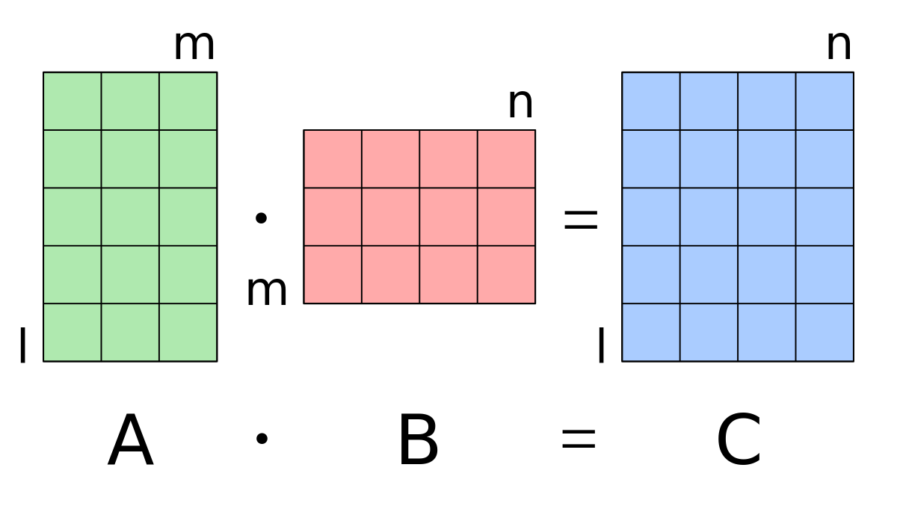

# Matrix Multiplication (Multi-Threading)



## 1. Objectives

* To get familiar with thread programming using the [Pthread library](https://hpc-tutorials.llnl.gov/posix/).
* To better understand processes and threads.

## 2. Overview

This is implementing a multi-threaded [matrix multiplication](https://www.mathsisfun.com/algebra/matrix-multiplying.html) program.

The input to the program is two matrixes A(x*y) and B(y*z) that are read from corresponding text files. The output is a matrix C(x*z) that is written to an output text file.

A parallelized version of matrix multiplication can be done using one of these three methods:

1. A thread computes the output C matrix i.e. without multi-threading. (A thread per matrix).
   
2. A thread computes each row in the output C matrix. (A thread per row).
   
3. A thread computes each element in the output C matrix. (A thread per element).
   

## 3. Implementation Details

### 3.1. File Format

The matrices are stored in text files with the following format:

```row=
<value11> <value12> ... <value1N>
<value21> <value22> ... <value2N>
...
<valueM1> <valueM2> ... <valueMN>
```

Example:

```
row=2 col=3
1 2 3
4 5 6
```

### 3.2. Compilation and Execution

#### 3.2.1. Compilation

Use the following command to compile the program:

```
gcc -o matrix_mult matrix_mult.c -lpthread
```

#### 3.2.2. Execution

Run the program with the following command:

```
./matrix_mult <input_matrix_A> <input_matrix_B> <output_prefix>
```

If no arguments are provided, the program uses the default filenames: `a.txt`,` b.txt`, `c`

Example:

```
./matrix_mult matrixA.txt matrixB.txt result
```

This generates three output files:

* `result_per_matrix.txt`
* `result_per_row.txt`
* `result_per_element.txt`

### 3.3. Methods of Matrix Multiplication

1. **Per Matrix (Single Thread)**
   * A single thread performs the entire matrix multiplication.
   * Suitable for small matrices or for performance comparisons.
2. **Per Row (Multi-Threading Per Row)**
   * Each row of the result matrix is computed in a separate thread.
   * Efficient for moderately sized matrices.
3. **Per Element (Multi-Threading Per Element)**
   * Each element of the result matrix is computed in a separate thread.
   * Highly parallelized but may have significant thread creation overhead for large matrices.

### 3.4. Performance Measurement

The program measures execution time using the `gettimeofday` function and prints:

* Total time taken in seconds and microseconds.
* Number of threads created for each method.

## 4. Memory Management

* The program dynamically allocates memory for matrices.
* Allocated memory is freed before program termination to prevent memory leaks.
## 5. References

* [POSIX Threads Programming](https://hpc-tutorials.llnl.gov/posix/)
* [Matrix Multiplication](https://www.mathsisfun.com/algebra/matrix-multiplying.html)

